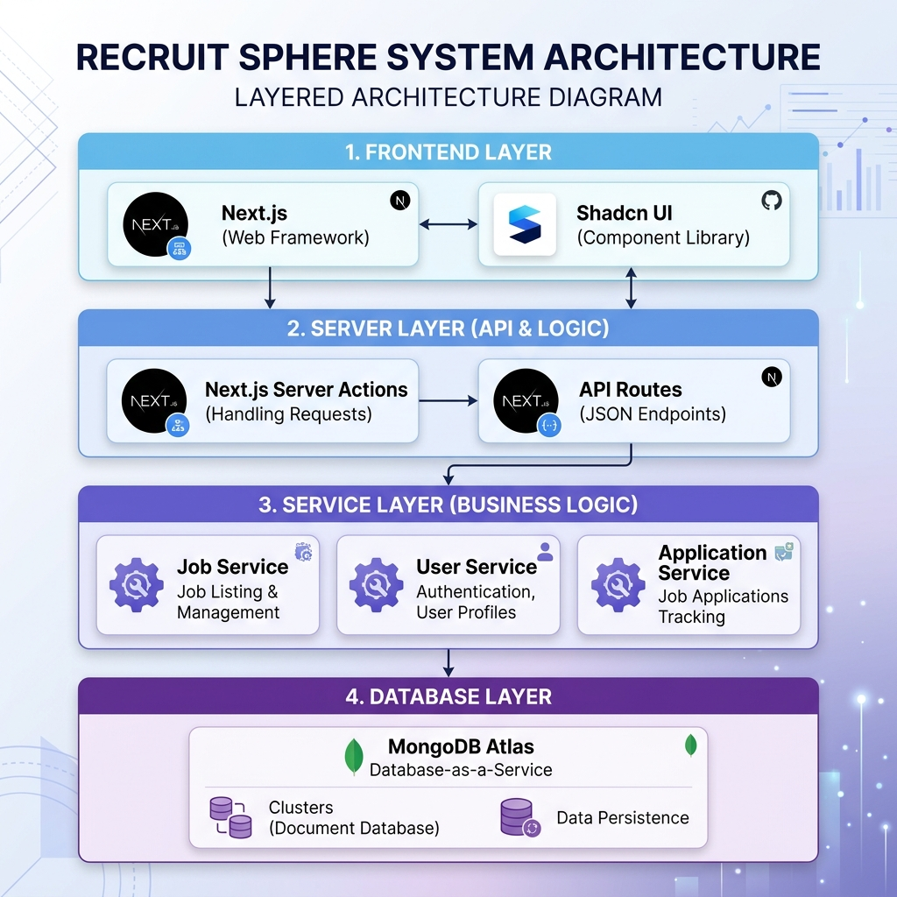
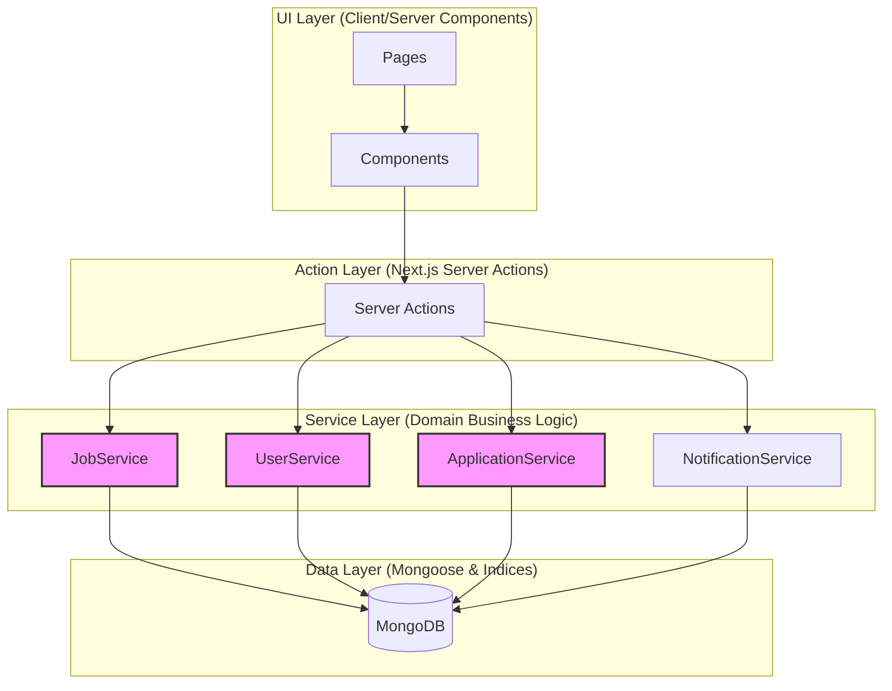

# Recruit Sphere: Advanced AI-Driven Recruitment Platform

Recruit Sphere is a professional-grade, full-stack recruitment platform designed to streamline the hiring process with automated ATS (Applicant Tracking System) scoring, multi-channel notifications, and high-performance dashboard analytics.

---

## 🚀 Key Features

- **Automated ATS Scoring**: Intelligent resume parsing that ranks candidates based on job-specific criteria and keywords.
- **Dynamic Hiring Pipelines**: Configurable recruitment stages (Coding rounds, Interviews, Offers) for every job posting.
- **High-Performance Architecture**: Built with Next.js 14 (App Router) using a streaming architecture for near-instant perceived speed.
- **Centralized Logic**: Pure Service-Oriented Architecture (SOA) that decouples business logic from UI components.
- **Real-time Notifications**: Integrated automated email system (SMTP) and in-app alerts for candidates and recruiters.
- **Comprehensive Candidate Profiles**: Rich profile management including skill tracking, experience history, and resume hosting.

---

## 🛠️ Technology Stack

- **Frontend**: Next.js 14, React 19, Tailwind CSS, Shadcn UI
- **State Management**: Zustand (Global UI), TanStack Query (Server State)
- **Backend Orchestration**: Next.js Server Actions with a dedicated **Service Layer**
- **Database**: MongoDB with Mongoose (Optimized Indexing)
- **Validation**: Zod (End-to-end type safety)
- **Security**: Server-side cookie-based sessions with Middleware protection

---

## 🏗️ System Architecture



*High-level overview of the Recruit Sphere service-oriented architecture.*

<details>
<summary>▶ Technical Topology (Click to expand)</summary>



</details>

### Core Design Principles:
1.  **Dumb Actions, Smart Services**: Server Actions act only as thin entry points; all complex logic resides in the Service Layer for testability.
2.  **Streaming & Suspense**: Critical data-heavy pages use `loading.tsx` and React Suspense boundaries to eliminate blank screens.
3.  **Database Indexing**: High-performance MongoDB queries through strategic indexing on `createdAt`, `status`, and `recruiterId`.

---

## 📁 Project Structure

```bash
src/
├── app/               # Next.js App Router (Routes & Skeletons)
├── components/        # Reusable UI components (Shared)
├── features/          # Domain-driven feature modules (Jobs, Auth, Profile)
├── lib/               # Utility functions & Database configuration
├── models/            # Mongoose Schemas & Database Models
├── services/          # Centralized Business Logic (The brain of the app)
└── shared/            # Shared types and Zod schemas
```

---

## ⚙️ Installation & Setup

1. **Clone the repository**:
   ```bash
   git clone https://github.com/varni1512/Recruit_Sphere.git
   cd Recruit_Sphere
   ```

2. **Install dependencies**:
   ```bash
   npm install
   ```

3. **Environment Setup**:
   Create a `.env.local` file with the following:
   ```env
   MONGODB_URI=your_mongodb_connection_string
   SMTP_HOST=your_smtp_host
   SMTP_PORT=your_smtp_port
   SMTP_USER=your_smtp_user
   SMTP_PASS=your_smtp_password
   ```

4. **Run in development**:
   ```bash
   npm run dev
   ```

---

## 📊 Performance Optimization
- **Database**: Standardized on `.lean()` queries with indexing for maximum throughput.
- **Rendering**: Implemented Parallel Data Fetching (`Promise.all`) in the Dashboard to reduce initial load latency.
- **Bundle**: Optimized via dynamic imports for heavy components like charts.

---

## 📝 License
Distributed under the MIT License. See `LICENSE` for more information.
